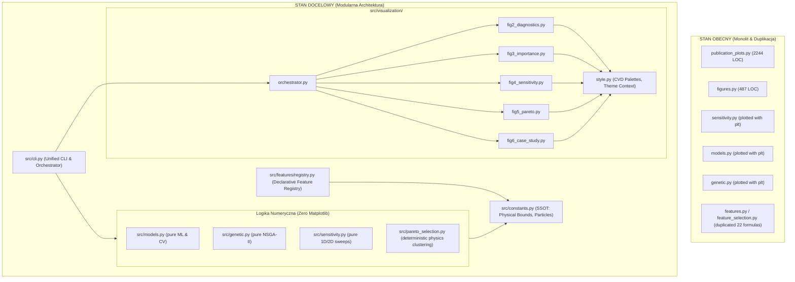

# Plan Code Review i Refaktoryzacji Pipeline'u: GHGT-Inertial-Separator

## Goal Description
Celem jest przeprowadzenie głębokiego code review oraz kompleksowej refaktoryzacji pipeline'u obliczeniowo-badawczego separatora bezwładnościowego (`GHGT-Inertial-Separator`). 

Projekt łączy uczenie maszynowe (modele zastępcze ExtraTreesRegressor), analizę wrażliwości, optymalizację wielokryterialną NSGA-II (DEAP) oraz generowanie figur o jakości publikacyjnej (Nature/Elsevier). W obecnej postaci kod cierpi na typowe syndromy kodu spaghetti i długu technologicznego:
- Monolityczny plik wizualizacyjny [`src/visualization/publication_plots.py`](file:///C:/Users/lukas/.gemini/antigravity/worktrees/MsCO2limit/plan_pipeline_refactor/src/visualization/publication_plots.py) o objętości **2244 linii**, zawierający setki linii powielonego kodu (kopiuj-wklej) dla pojedynczych paneli i siatek wykresów.
- Złamanie Single Responsibility Principle (SRP): moduły ML ([`src/models.py`](file:///C:/Users/lukas/.gemini/antigravity/worktrees/MsCO2limit/plan_pipeline_refactor/src/models.py)), optymalizacji ([`src/genetic.py`](file:///C:/Users/lukas/.gemini/antigravity/worktrees/MsCO2limit/plan_pipeline_refactor/src/genetic.py)) oraz wrażliwości ([`src/sensitivity.py`](file:///C:/Users/lukas/.gemini/antigravity/worktrees/MsCO2limit/plan_pipeline_refactor/src/sensitivity.py)) samodzielnie kreślą wykresy `matplotlib` i zapisują pliki PNG/PDF, ignorując dedykowany moduł wizualizacji.
- Potrójna duplikacja generowania siatek sweepów parametrów (w `sensitivity.py`, `figures.py` i `publication_plots.py`).
- Zdublowanie 22 formuł inżynierii cech pomiędzy [`src/features.py`](file:///C:/Users/lukas/.gemini/antigravity/worktrees/MsCO2limit/plan_pipeline_refactor/src/features.py) a [`src/feature_selection.py`](file:///C:/Users/lukas/.gemini/antigravity/worktrees/MsCO2limit/plan_pipeline_refactor/src/feature_selection.py).
- **Krytyczny błąd niszczenia danych referencyjnych**: w [`src/pipeline.py`](file:///C:/Users/lukas/.gemini/antigravity/worktrees/MsCO2limit/plan_pipeline_refactor/src/pipeline.py) uruchomienie z flagą `--demo` w kroku `select_features` trwale nadpisuje plik surowy [`data/demo/inertial_separator_demo.csv`](file:///C:/Users/lukas/.gemini/antigravity/worktrees/MsCO2limit/plan_pipeline_refactor/data/demo/inertial_separator_demo.csv).
- **Merytoryczny błąd etykietowania w Figurze 5**: [`src/pareto_selection.py`](file:///C:/Users/lukas/.gemini/antigravity/worktrees/MsCO2limit/plan_pipeline_refactor/src/pareto_selection.py) dzieli zbiór Pareto na 3 klastry na podstawie celów $(N_1, N_2)$, podczas gdy [`src/visualization/figures.py`](file:///C:/Users/lukas/.gemini/antigravity/worktrees/MsCO2limit/plan_pipeline_refactor/src/visualization/figures.py) sztywno mapuje 2 klastry na wysokości $H_2 \approx 59\text{ mm}$ i $39\text{ mm}$, przypisując klastrowi o $H_2 = 60.9\text{ mm}$ fałszywą etykietę $39\text{ mm}$.
- Zahardcodowane punkty optymalne w Figurze 6, ignorujące faktyczne wyniki z pliku `pareto_optimal_designs.csv`.
- Skutki uboczne przy imporcie: [`config/path.py`](file:///C:/Users/lukas/.gemini/antigravity/worktrees/MsCO2limit/plan_pipeline_refactor/config/path.py) tworzy 16 folderów na dysku przy załadowaniu modułu.

Plan refaktoryzacji realizuje strategię **Clean Architecture** i **Zero-Regression** (gwarancja niezmienności wyników numerycznych i fizycznych).

---

## User Review Required

> [!IMPORTANT]
> **1. Usunięcie `pymoo` z `requirements.txt`**:
> Pakiet `pymoo` nie jest zainstalowany w środowisku wykonawczym i wymaga kompilatorów C++ (MSVC) na Windowsie. Pipeline opiera się w 100% na bibliotece `deap` z wbudowanym algorytmem Deba. Proponujemy usunąć martwą zależność `pymoo` z `requirements.txt`.

> [!WARNING]
> **2. Rozwiązanie klastrowania frontu Pareto (Figura 5 i 6)**:
> Dotychczasowy K-Means dzielił punkty na 3 grupy względem $(N_1, N_2)$, co było niezgodne z dwuklastrową interpretacją fizyczną opartą na wysokości szczeliny $H_2$ ($59\text{ mm}$ vs $39\text{ mm}$). Proponujemy:
> - Opcja A (Rekomendowana): Deterministyczny podział na 2 reżimy geometryczne na podstawie progu fizycznego $H_2 \ge 0.05\text{ m}$ (reżim wysokiej szczeliny $\approx 59\text{ mm}$) oraz $H_2 < 0.05\text{ m}$ (reżim niskiej szczeliny $\approx 39\text{ mm}$). Gwarantuje to 100% spójności fizycznej i eliminuje losowość K-Means.
> - Opcja B: Sortowanie klastrów K-Means malejąco po średniej wartości $H_2$ z wymuszeniem `n_clusters=2`.

> [!NOTE]
> **3. Stopniowa deprecacja artefaktów legacy**:
> Pliki `Test5_Results_src.csv` oraz `Final_Model.joblib` to historyczne nazwy. Zastąpimy je kanonicznymi `pareto_optimal_designs.csv` oraz `surrogate_regressor.joblib`, zachowując generowanie aliasów legacy z ostrzeżeniem `FutureWarning`.

---

## Open Questions

1. **Figura 6 – punkty referencyjne**:
   Czy Figura 6 powinna automatycznie wybierać punkty ze świeżo wyliczonego pliku `pareto_optimal_designs.csv` (Opt 1: minimum $N_1$, Opt 2: maksimum $\Delta$) z automatycznym fallbackiem na historyczne punkty CFD z artykułu, gdy plik nie istnieje? *(Rekomendacja: Tak, dynamiczna selekcja z fallbackiem).*
2. **Framework testowy**:
   W środowisku użytkownika pakiet `pytest` nie jest zainstalowany, natomiast standardowy moduł `unittest` działa bezpośrednio (`python -m unittest discover tests`). Czy zestaw testów ma pozostać w 100% kompatybilny ze standardowym `unittest` bez wymuszania instalacji dodatkowych bibliotek? *(Rekomendacja: Tak).*

---

## Proposed Changes



---

### Komponent 1: Bezpieczeństwo i Siatka Testów Bazowych (`tests/`)

Przed wprowadzeniem jakichkolwiek modyfikacji kodu utworzona zostanie pełna siatka testów w standardzie `unittest`, sprawdzająca niezmienniki fizyczne i numeryczne.

#### [NEW] `tests/test_constants.py`
- Sprawdza bilans cząstek: `TOTAL_PARTICLES == 6417`.
- Sprawdza poprawność zakresów parametrów geometrycznych (`Alfa`, `Beta`, `H1`, `H2`).

#### [NEW] `tests/test_physics_balance.py`
- Weryfikuje $N_1 + N_2 + N_3 = 6417$ oraz $N_1 \ge 0$, $\Delta \ge 0$, $N_2 = N_1 + \Delta$.
- Sprawdza poprawność obliczeń sprawności $\eta_1, \eta_2$.

#### [NEW] `tests/test_features.py`
- Testuje rejestr cech `FeatureRegistry`.
- Porównuje wyjścia z nowo wyliczonych cech z referencyjnymi kolumnami na zbiorze demo.

#### [NEW] `tests/test_pipeline_demo.py`
- Testuje pełen cykl `python -m src.pipeline --demo --all` w odizolowanym folderze tymczasowym.
- **Kluczowa asercja**: plik `data/demo/inertial_separator_demo.csv` nie ulega modyfikacji (porównanie sumy kontrolnej MD5/SHA256 przed i po wykonaniu pipeline'u).

---

### Komponent 2: Centralizacja Stałych i Usunięcie Efektów Ubocznych

#### [NEW] `src/constants.py`
Pojedyncze źródło prawdy (SSOT) dla całego repozytorium:
```python
TOTAL_PARTICLES: int = 6417

BASE_FEATURES = ["Alfa", "Beta", "H1", "H2"]
TARGET_COLUMNS = ["N1", "N2", "Delta"]

PARAM_BOUNDS = {
    "Alfa": (42.75, 60.0),
    "Beta": (42.75, 60.0),
    "H1": (0.0080, 0.0609),
    "H2": (0.0080, 0.0609),
}

NOMINAL_BASELINE = {
    "Alfa": 60.0,
    "Beta": 60.0,
    "H1": 0.0380,
    "H2": 0.0380,
}

PARAM_UNITS = {
    "Alfa": "deg",
    "Beta": "deg",
    "H1": "m",
    "H2": "m",
}
```

#### [MODIFY] `config/path.py`
- Usunięcie automatycznego wywołania `create_directories()` z poziomu importu modułu.
- Przeniesienie wywołania do jawnej metody w punktach wejścia CLI.
- Oznaczenie ścieżek legacy dekoratorem deprecacji przy zachowaniu wstecznej kompatybilności.

---

### Komponent 3: Rejestr Cech i Likwidacja Duplikacji Formuł

#### [NEW] `src/features/registry.py`
Deklaratywny rejestr zapobiegający rozjeżdżaniu się wzorów:
```python
class FeatureRegistry:
    _registry = {}

    @classmethod
    def register(cls, name: str, dependencies: list[str]):
        def decorator(fn):
            cls._registry[name] = {"func": fn, "deps": dependencies}
            return fn
        return decorator

    @classmethod
    def compute_all(cls, df: pd.DataFrame) -> pd.DataFrame:
        df_out = df.copy()
        for name, spec in cls._registry.items():
            df_out[name] = spec["func"](df)
        return df_out
```

#### [MODIFY] `src/features.py`
- Zastąpienie drabinki `if/elif` w `compute_single_feature` odpytaniem rejestru `FeatureRegistry`.
- Eliminacja ostrzeżeń `SettingWithCopyWarning` i fragmentacji ramek danych pandas (`pd.concat` zamiast sekwencyjnego dopisywania kolumn w pętli).

#### [MODIFY] `src/feature_selection.py`
- Funkcja `generate_candidate_features()` korzysta bezpośrednio z `FeatureRegistry.compute_all()`, eliminując 50 linii powtórzonych formuł algebraicznych i trygonometrycznych.

---

### Komponent 4: Czysty Podział Obliczeń i Prezentacji (Separation of Concerns)

#### [MODIFY] `src/models.py`
- Całkowite usunięcie `plot_actual_vs_predicted()` i zależności od `matplotlib`.
- Zastąpienie ewaluacji przy imporcie leniwym ładowaniem parametrów: `get_best_params()`, `get_selected_features()`.
- Usunięcie podwójnego zapisu `Final_Model.joblib` (standaryzacja na `surrogate_regressor.joblib`).

#### [MODIFY] `src/genetic.py`
- Usunięcie rysowania wykresu zbieżności `plt.figure(...)` wewnątrz pętli optymalizacyjnej.
- Zwracanie czystego `log_df` (DataFrame z historią generacji: min, mean, std dla $N_1$ i $\Delta$).
- Enkapsulacja konfiguracji `DEAP` w klasę `NSGA2Optimizer`, eliminująca kolizje typów w globalnym module `creator`.

#### [MODIFY] `src/sensitivity.py`
- Usunięcie 3 funkcji kreślących wykresy z użyciem `matplotlib` (`plot_sensitivity_analysis`, `plot_combined_view`, `plot_heatmap_interactions`).
- Moduł staje się czystym silnikiem analitycznym (generującym wektory i siatki meshgrid dla sweepów 1D i 2D), współdzielonym przez pipeline i moduły wizualizacji.

#### [MODIFY] `src/pareto_selection.py`
- Naprawa klastrowania: podział frontu Pareto na 2 spójne fizycznie reżimy geometryczne na podstawie $H_2$ ($H_2 \ge 50\text{ mm}$ vs $H_2 < 50\text{ mm}$) lub deterministyczne klastrowanie 2-grupowe posortowane po $H_2$.
- Gwarancja, że etykiety klastrów w wynikowym pliku `pareto_optimal_designs.csv` są w 100% zgodne z fizycznymi wymiarami separatora.

---

### Komponent 5: Dekompozycja Modułu Wizualizacji (`publication_plots.py` 2244 LOC)

Rozbicie gigantycznego pliku na spójne, wyspecjalizowane moduły oparte na kompozycji (funkcje rysują na przekazanym obiekcie `ax: matplotlib.axes.Axes`):

#### [NEW] `src/visualization/style.py` (~130 LOC)
- Konfiguracja stylów publikacyjnych (Nature/Elsevier).
- Palety bezpieczne dla osób z zaburzeniami rozpoznawania barw (CVD: Okabe-Ito, Tol-Bright).
- Context manager `publication_style()`.
- Funkcje pomocnicze: `add_panel_label(ax, 'a')`, `format_r2()`.

#### [NEW] `src/visualization/fig2_diagnostics.py` (~150 LOC)
- `draw_parity_panel(ax, y_true, y_pred, target_name)`: bazowy rysownik panelu parzystości.
- `draw_residuals_panel(ax, residuals)`: bazowy rysownik residuów.
- `plot_model_diagnostics()`: kompozycja siatki 2x2.
- `plot_parity_single()`: kompozycja pojedynczego panelu (wykorzystuje tę samą funkcję bazową!).

#### [NEW] `src/visualization/fig3_importance.py` (~130 LOC)
- `draw_importance_bars(ax, df_imp)`: kompozytowe słupki ważności cech.
- `plot_feature_importance()` i `plot_feature_importance_single()`.

#### [NEW] `src/visualization/fig4_sensitivity.py` (~180 LOC)
- Wykorzystuje czyste dane z `src/sensitivity.py`.
- `draw_sweep_1d_panel(ax, param, sweep_df)`.
- `draw_contour_2d_panel(ax, x_mesh, y_mesh, z_mesh)`.

#### [NEW] `src/visualization/fig5_pareto.py` (~180 LOC)
- `draw_convergence(ax, log_df)`.
- `draw_pareto_front(ax, pop_df, pareto_df, clusters)`.
- Poprawne, spójne podpisywanie reżimów geometrycznych.

#### [NEW] `src/visualization/fig6_case_study.py` (~140 LOC)
- `draw_comparison_bars(ax, comparison_df)`.
- Dynamiczne pobieranie wariantów optymalnych z `pareto_optimal_designs.csv` z fallbackiem na stałe CFD.

#### [NEW] `src/visualization/orchestrator.py` (~120 LOC)
- Zastępuje [`src/visualization/figures.py`](file:///C:/Users/lukas/.gemini/antigravity/worktrees/MsCO2limit/plan_pipeline_refactor/src/visualization/figures.py).
- Czyste metody orkiestrujące `generate_figure_2()`, ..., `generate_figure_6()`, `generate_all_figures()`.
- Jawna obsługa parametru `use_demo: bool`.

#### [MODIFY] `src/visualization/publication_plots.py`
- Zastąpienie 2244 linii kodu cienką warstwą re-eksportów fasadowych (`__all__`), zapewniającą 100% kompatybilności wstecznej dla zewnętrznych skryptów bez duplikacji kodu.

---

### Komponent 6: Spójne CLI i Naprawa Błędów Pipeline'u

#### [NEW] `src/cli.py`
- Połączenie [`src/__main__.py`](file:///C:/Users/lukas/.gemini/antigravity/worktrees/MsCO2limit/plan_pipeline_refactor/src/__main__.py) i [`src/pipeline.py`](file:///C:/Users/lukas/.gemini/antigravity/worktrees/MsCO2limit/plan_pipeline_refactor/src/pipeline.py) w jeden elegancki interfejs CLI.
- Naprawa błędu podwójnego generowania Figury 2 przy fladze `--all`.

#### [MODIFY] `src/pipeline.py`
- **Naprawa krytycznego błędu danych demo**:
```python
# PRZED (błąd):
if use_demo:
    return demo_data_file, demo_data_file, features_json_path

# PO (poprawnie):
if use_demo:
    demo_processed_path = processed_data_dir / "df_selected_demo.csv"
    return demo_data_file, demo_processed_path, features_json_path
```

---

## Verification Plan

### Automated Tests
1. **Uruchomienie pełnego pakietu testów bazowych (przed i po każdym kroku refaktoryzacji)**:
   ```powershell
   python -m unittest discover tests -v
   ```
2. **Weryfikacja integralności danych demo (brak nadpisywania)**:
   - Obliczenie sumy kontrolnej pliku surowego:
     ```powershell
     certutil -hashfile data/demo/inertial_separator_demo.csv SHA256
     ```
   - Uruchomienie kroku feature selection:
     ```powershell
     python -m src.pipeline --demo --step select_features
     ```
   - Ponowne sprawdzenie sumy kontrolnej – musi być identyczna.
3. **Uruchomienie kompletnego pipeline'u w trybie demonstracyjnym**:
   ```powershell
   python -m src.pipeline --demo --all
   ```
4. **Weryfikacja generowania wszystkich figur publikacyjnych**:
   ```powershell
   python -m src.visualization.orchestrator --demo --all
   ```
   - Sprawdzenie obecności plików: `Figure_2_Model_Diagnostics.png`, `Figure_3_Feature_Importance.png`, `Figure_4_Sensitivity_Analysis.png`, `Figure_5_Pareto_Optimization.png`, `Figure_6_Optimization_Comparison.png`.
5. **Weryfikacja jakości kodu i linterów**:
   ```powershell
   python -m flake8 src/ tests/ --max-line-length=100 --extend-ignore=E203,W503
   ```

### Manual Verification
1. **Wizualna inspekcja Figury 5 (`Figure_5_Pareto_Optimization.png`)**:
   - Sprawdzenie, czy etykiety legendy klastrów ($H_2 \approx 59\text{ mm}$ oraz $H_2 \approx 39\text{ mm}$) odpowiadają faktycznym punktom klastrów i czy żaden klaster nie ma etykiety zastępczej "Pareto cluster 3".
2. **Inspekcja Figury 6 (`Figure_6_Optimization_Comparison.png`)**:
   - Sprawdzenie, czy słupki wariantu Opt 1 i Opt 2 odpowiadają punktom wybranym przez algorytm NSGA-II.
3. **Weryfikacja czystości importów**:
   - Uruchomienie `python -c "import config.path"` na czystym repozytorium i upewnienie się, że nie utworzyło niepożądanych folderów bez zgody użytkownika.
